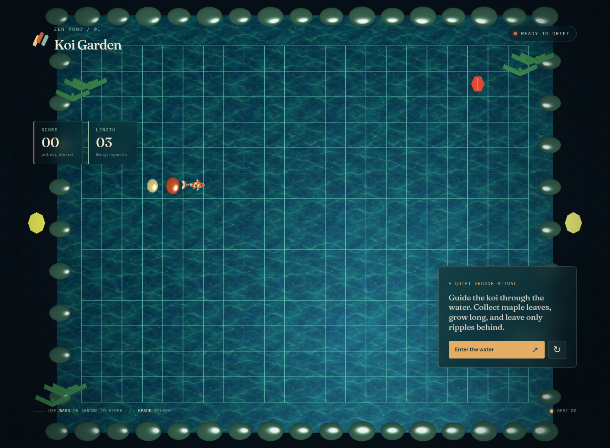
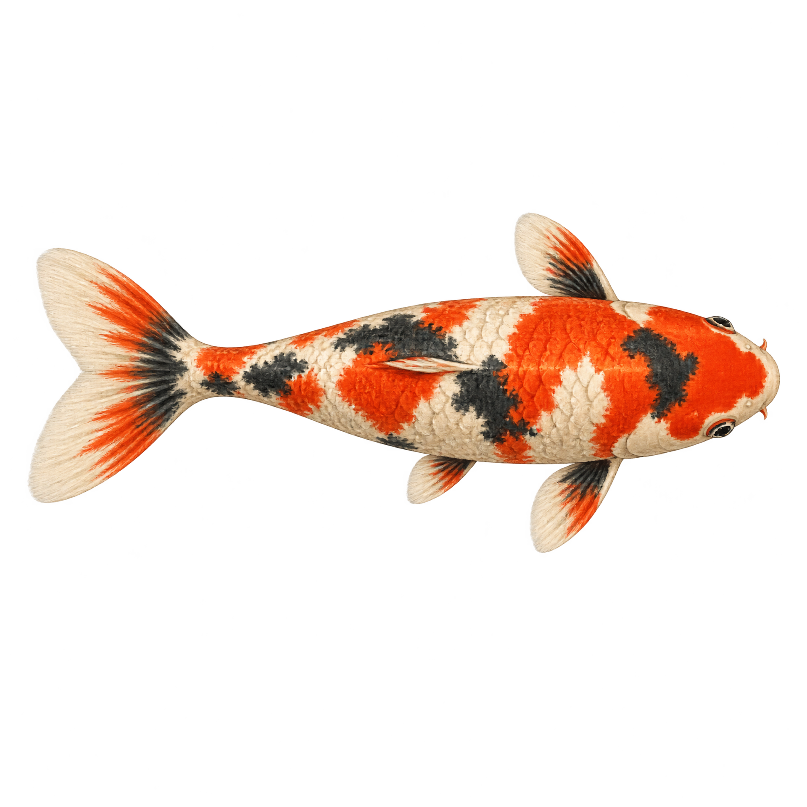
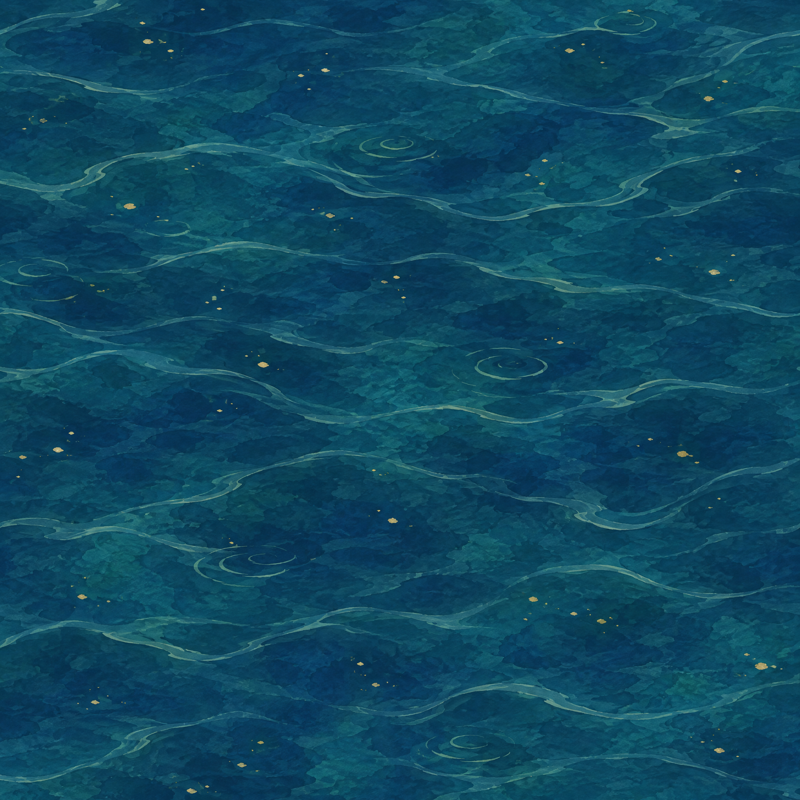

# Koi Zen Snake



Koi Zen Snake is a classic grid-based Snake game reimagined as a quiet Japanese garden pond. Guide a koi through indigo water, collect floating maple leaves, grow longer with every bite, and avoid the pond edge and your own body. Each movement leaves a short-lived ripple trail behind.

The game is built as a full-screen React and Babylon.js experience with a top-down orthographic camera, bundled visual assets, procedural garden props, responsive HUD, keyboard controls, touch controls, pause/restart states, best-score tracking, and a deterministic demo mode for visual verification.

## Play

Use **Arrow keys** or **WASD** to steer the koi. Press **Space** to pause or resume. Press **R** to restart. On touch screens, use the on-screen directional pad. The game starts from the `Enter the water` button or the first direction input.

A game ends when the koi hits the pond boundary or its own body. The score increases by 10 for every maple leaf collected, the body grows by one segment, and the movement speed increases gently as the run continues.

## Demo mode

Open the game with `?demo` to run the deterministic autopilot:

```text
/?demo
```

The demo steers toward a known sequence of food cells so the game can demonstrate movement, scoring, body growth, and ripples without manual input.

## Visual assets

The game uses a generated koi cutout and a seamless pond texture alongside procedural garden geometry.

| Koi sprite | Pond texture |
|---|---|
|  |  |

## Technology

- React 19 and TypeScript
- Vite 7
- Babylon.js 9
- Tailwind CSS 4 for the project baseline
- Procedural Babylon meshes for garden stones, bamboo, lanterns, torii, food, body segments, grid, and ripples

## Local development

Install dependencies and start the Vite development server:

```bash
pnpm install
pnpm dev
```

Run the project checks and production build:

```bash
pnpm check
pnpm build
```

The game is self-contained: runtime images are bundled under `client/public/assets/` and resolve to `/assets/koi-sprite.png` and `/assets/water-tile.png`.

## Project structure

```text
client/src/App.tsx                    React HUD and game actions
client/src/components/GameCanvas.tsx  Babylon engine lifecycle bridge
client/src/game/input.ts              Semantic keyboard input
client/src/game/scene.ts              Scene, camera, lighting, and handle
client/src/game/world.ts              Grid rules, collision, score, visuals
client/public/assets/                 Bundled koi and pond images
docs/                                 README preview and asset images
PLAN.md                               Gameplay risks and verification criteria
STRUCTURE.md                          Runtime architecture
ASSETS.md                             Generated and procedural art manifest
MEMORY.md                             Implementation notes
```

## Visual direction

The game uses a restrained midnight-indigo, jade, terracotta, paper-cream, and muted-gold palette. The pond texture and koi sprite provide the visual anchors; the surrounding stones, bamboo, lanterns, and torii are procedural so their silhouettes stay crisp and readable at different viewport sizes. The HUD combines Fraunces, Manrope, and DM Mono to distinguish the editorial title, gameplay copy, and compact status labels.
